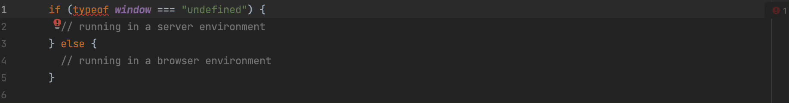

# eslint-plugin-no-typeof-window-undefined

ESLint rule that helps avoid `typeof window === "undefined"` check and fix it to `typeof document === "undefined"`
instead.
It's recommended to use `document` over `window` because server runtimes like Deno have a global window available.

[](https://badge.fury.io/js/eslint-plugin-no-typeof-window-undefined)



## Installation

```bash
$ pnpm add -D eslint eslint-plugin-no-typeof-window-undefined
```

## Usage

Add to `.eslintrc`

```json
{
  "extends": [
    "plugin:no-typeof-window-undefined/recommended"
  ]
}
```

## Rules

✅ Set in the `recommended` configuration
🔧 Automatically fixable by the [`--fix` CLI option](https://eslint.org/docs/user-guide/command-line-interface#--fix).\


| Name                                                                                             | Description                                                                                                                                                                                                       | 💼 | 🔧 |
| :----------------------------------------------------------------------------------------------- | :---------------------------------------------------------------------------------------------------------------------------------------------------------------------------------------------------------------- | :- | :- |
| [no-typeof-window-undefined](docs/rules/no-typeof-window-undefined.md)                                                       | Improve SSR/Browser environment check by using typeof document !== "undefined".                                                                                                                                                    | ✅  |🔧 |

### no-typeof-window-undefined

Because the same JavaScript code can run in the browser as well as the server, sometimes you need to have a part of your
code that only runs in one context or the other:

```ts
if (typeof window === "undefined") {
// running in a server environment
} else {
// running in a browser environment
}
```

This works fine in a Node.js environment, however, Deno actually supports window! So if you really want to check whether
you're running in the browser, it's better to check for document instead:

```ts
if (typeof document === "undefined") {
// running in a server environment
} else {
// running in a browser environment
}
```

This will work for all JS environments (Node.js, Deno, Workers, etc.).


## Credits

- https://twitter.com/JLarky/status/1598147116093693952
- [Remix documentation](https://remix.run/docs/en/v1/pages/gotchas#typeof-window-checks)
